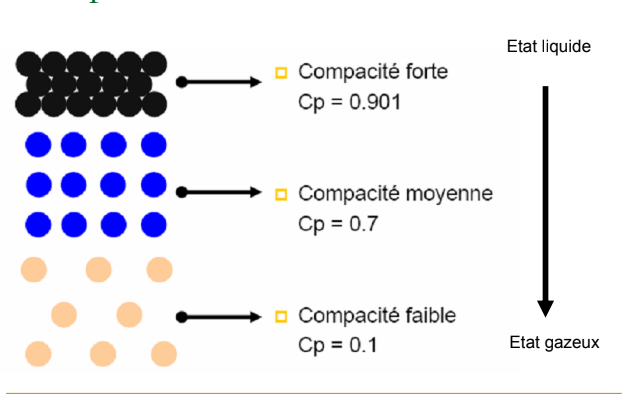
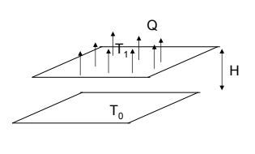

== Documentation
=== Contents
1 <<introduction,Introduction>> +
2 <<Computational_Fluid_Dynamics,Computational Fluid Dynamics>> +
3 <<Computational_Solid_Mechanics,Computational Solid Mechanics>> +
4 <<Context,Context>>
[[introduction]]
=== Introduction
Regarding problems of <<Computational_Fluid_Dynamics,Computational Fluid Dynamics>> (<<Computational_Fluid_Dynamics,CFD>>) and <<Computational_Solid_Mechanics,Computational Solid Mechanics>> (<<Computational_Solid_Mechanics,CSM>>), there is a solving method to follow, including phases such as the verification phase, or the validation phase. +
This part deals with the validation phase, the aim is to check if the solved problem is the right one and not another, this can be done by comparing the results to a database.

=== Presentation of the project
==== Problem
This project consists in carrying out a simulation of internal, laminar, incompressible flow in a channel on a backward facing stage. Flow separation is a common and interesting phenomenon in fluid mechanics with significant effects in practical application. Among them the backward-facing step flow which represents a very popular reference and validation test for computational fluid dynamics (CFD) simulations due to the availability of a good number of good experimental data.

==== Backward-Facing Step (BFS)
Among the representative models of separation flows is the backward-Facing Step Flow (BFS), which can be seen in aerodynamic flows, engine flows, heat transfer systems, and even the flow around buildings, etc. +
The BFS is a very popular reference and validation model for Computational Fluid Dynamics (CFD) simulations because of the availability of a good number of experimental data.
Flow separation depends on several parameters such as BFS geometry, inlet and outlet conditions, turbulent intensity, as well as heat transfer conditions.
Although the geometry is very simple, the flow may have interesting separation regions, which also makes it an ideal candidate for testing numerical boundary conditions.

==== Objectives
- Test the coupling between pressure field and flow velocity
- Compare the results of the velocity profile with numerical results from the literature
- Prescribe input condition data from a file.

[[Computational_Fluid_Dynamics]]
=== Computational Fluid Dynamics (CFD)
==== What is a fluid ?
A fluid is a substance that flows (in other words, it takes the shape of its container) and does not resist to deformation (i.e. slips when moved). +
The terms fluid and liquid are often used interchangeably, but technically, the term fluid can refer to both a liquid and a gas. +
The distinction between liquids and gases can affect the way in which the fluid is modeled, but both have the same basic fluid formulae and comparable properties.

==== Compactness of a fluid:

==== Macroscopic properties of a fluid:
1. Dynamic viscosity: +
The viscosity of a fluid characterizes its resistance to speed of deformation (movement) caused by the application of a constraint (Force/surface). +
2. Compressibility: +
The ability of a fluid to undergo significant variations in density when applying a pressure step ∆P or a temperature variation ∆T. +
Two coefficients are used:
- isothermal compressibility coefficient: K_{t}
- Coefficient of thermal expansion at constant pressure beta.

3. Thermal diffusion:

The quantity q=Q/A is called heat flux density. It is a thermal power (Watts) exchanged per unit of surface area and is set: q=Q/A=-λ*(T1-T0)/H. +
The positive number λ is called the coefficient of thermal conductivity. It is expressed in W.m/K.

==== Hierarchy of fluid flow equations: +
Computational fluid dynamics (CFD) can be considered as a set of calculation methods for solving the equations governing fluid flow. +
In its application, the most important step is to be able to decide which set of physical assumptions and associated equations should be used, which highlights the hierarchy of flow equations solved with CFD.

Calculation methods can be:

- Conservation laws (CL)
- Continuum Conservation Legislation (CCL)
- Compressible Navier-Stokes Equations (C-NS)
- Incompressible Navier-Stokes Equations (I-NS)
- Compressible Euler equations (EE)
- Weakly compressible Navier-Stokes equations (WC-NS)
- Boussinesq's equations
- Ideal flow rate or potential flow equations
- Linearized compressible Euler equations (LEE)
- Sound wave or acoustic wave equation
- One-dimensional Euler equations or one-dimensional gas dynamics equations (1D-E)

==== Methodology
To solve a CFD problem, we mainly go through three steps: +
1. Definition of a geometry and a mesh discretizing the computational domain and the numerical methods used. +
2. Numerical solution of the problem +
3. Exploitation of the results +

[[Computational_Solid_Mechanics]]
=== Computational Solid Mechanics (CSM)
==== What is a solid?
A solid is, in opposition to a fluid (gaz or liquid), a substance which can not flow, and in a way, has a high resistance to deformation. It can be defined aswell as an entity which has an integrity, and to change it, you have to apply forces.

==== Macroscopic properties of a solid
Elasticity +
The most common pair of parameters which characterize the elasticity of a solid are the Poisson coefficent and the Young-Modulus: +
The coefficient characterize the contraction of a solid when it is under a perpendicular effort. +
And the modulus characterize the...

==== Differents equations used in CSM
The CSM can be seen as a group of calculation methods which are used to solve the equations directing the way a solid will react to any input. +
So the most important step is to decide what are the characteristics of the problem and which equations define it better. +
1) Linear elasticity +
2) Hyper-elasticity +
--Saint-Venant-Kirchhoff +
--Neo-Hookean -> there is an isochoric part and a volumetric part.

In feel++ the main interest is to study the axisymmetric reduced model.

==== Methodology
To solve a CSM problem, we usually proceed in three steps: +
1) Definition of a geometry and a mesh which change the problem to a discret one aswell as the domain and the numerical method used. +
2) The actual solving of the problem. +
3) The exploitation of the results.
[[Context]]
=== Context
==== Computational Fluid Dynamics
For *CFD* we constat that it supports both the incompressible Navier-Stokes and the Stokes equations. +
To do well the projet, it will based on properties namely the *density* and *viscosity*, and finally, we will not own the *Boundary Conditions*.

==== Computational Solid Mechanics
It works properly with equations like  *Linear elasticity*
and *Hyper-elasticity*. We can also use Axisymmetric reduced model.
